# 「方音圖鑑」方言比较功能

**Author:** 不羁

**Date:** 2026-07-02

**Link:** https://zhuanlan.zhihu.com/p/2023530288848930082

​

目录

收起

一、比较汉字

二、比较中古

演示

相似度算法

三、比较调类

四、结语

1\. 多方言点对比

2.单方言点深入分析

3.词句与工具

4.自然村名分析

原来「查询」界面展示的是各方言点详细的字音、各音韵地位音值音类、调值调类等，但我发现很多用户仅仅是想比较一下各方言点的异同，并没有那么关注具体的声韵信息。因此，「方音圖鑑」特意推出「方言比较」功能，以求简单、直观地展现比较方言点的差异。

链接：[方音圖鑑 - 音韻查詢](https://link.zhihu.com/?target=https%3A//dialects.yzup.top/menu/compare/)

## 一、比较汉字

比较岭南、岭西分区的「好」「口」的韵母

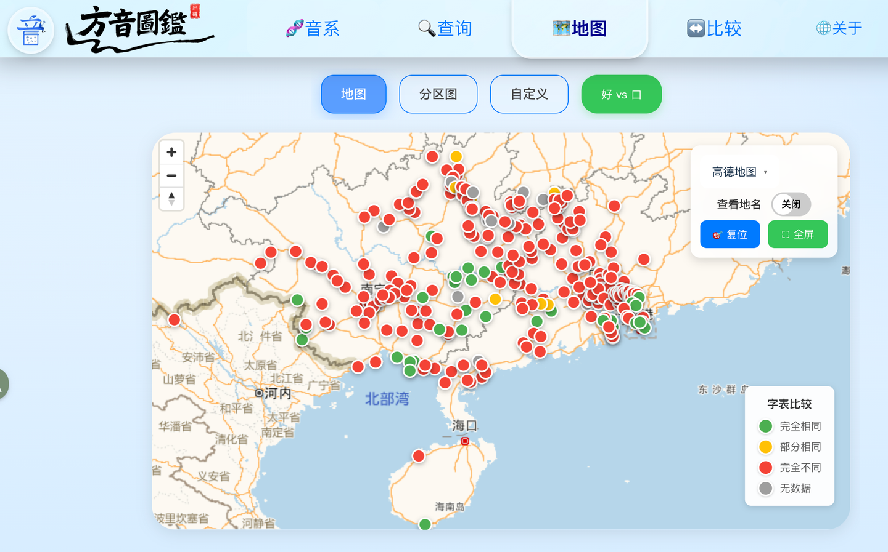

通过颜色直观地了解、比较：

-   「绿色」是「完全相同」
-   「黄色」是「部分相同」
-   「红色」则是「完全不同」

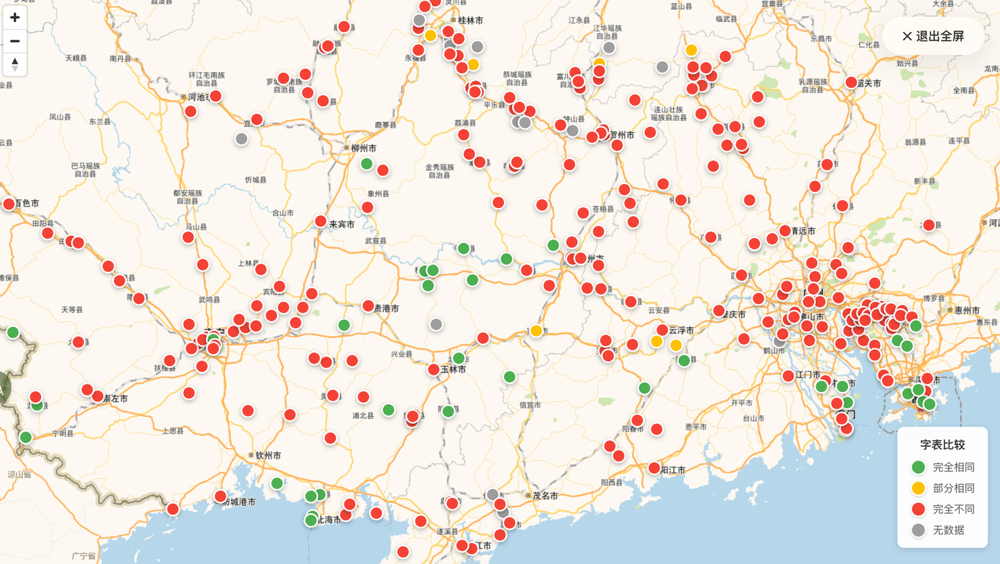

可以全屏放大查看

点击后显示弹窗，可以查看具体细节

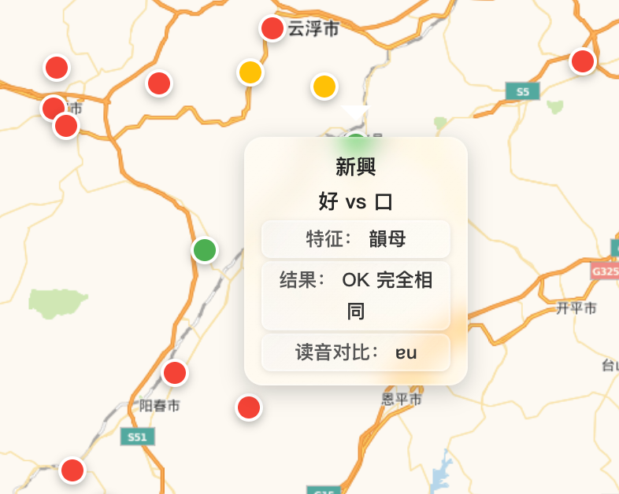

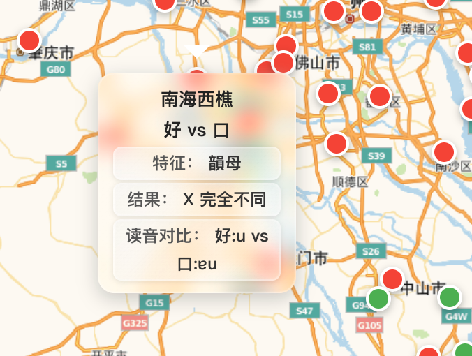

「心」与「时」的声母比较，可以大致看出粤方言的边擦音分布：

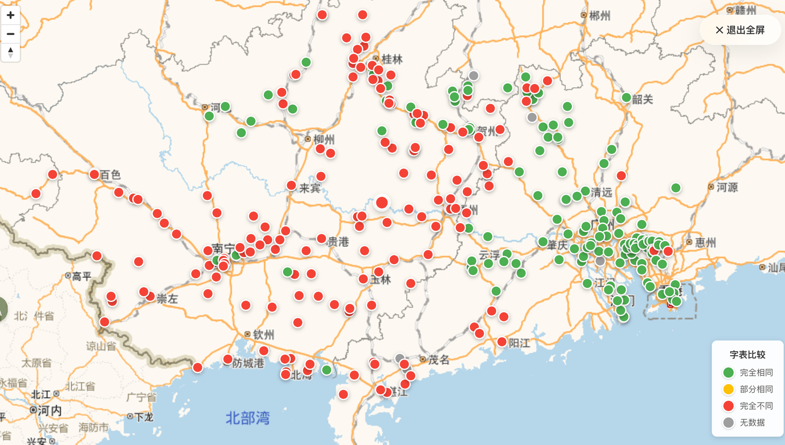

「客」与「黑」的调值比较，可以大致看出粤方言的阴入情况

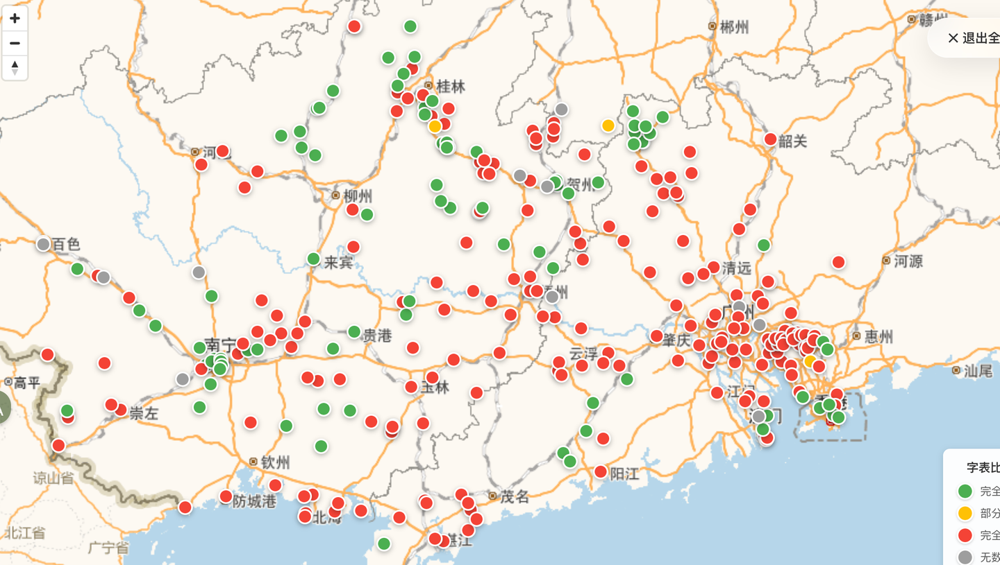

部分南方方言的「九」「酒」声母对比，可以大致看出颚化情况

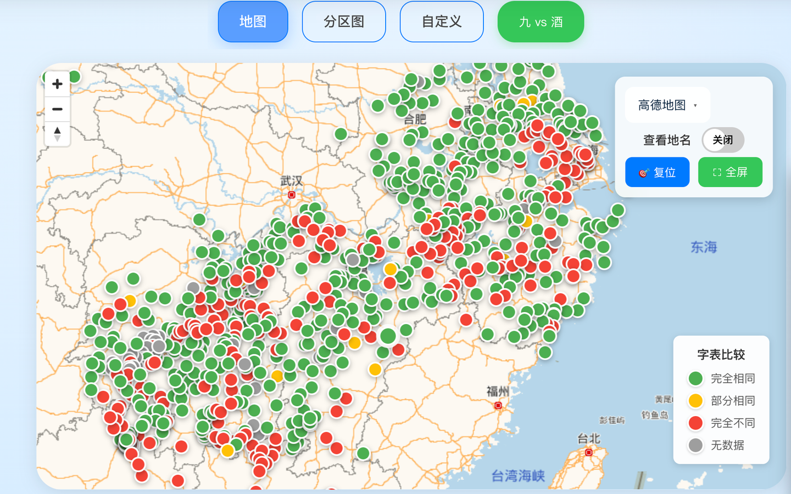

## 二、比较中古

### 演示

选择想要比较的中古地位，然后分别添加到组1和组2里。

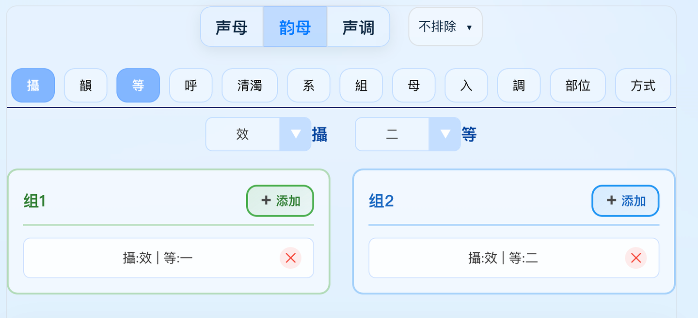

各地客家话的效摄一等和效摄二等对比

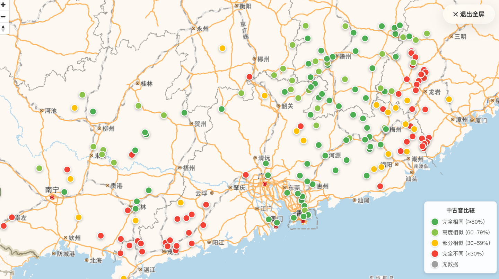

也可以弹窗查看具体信息

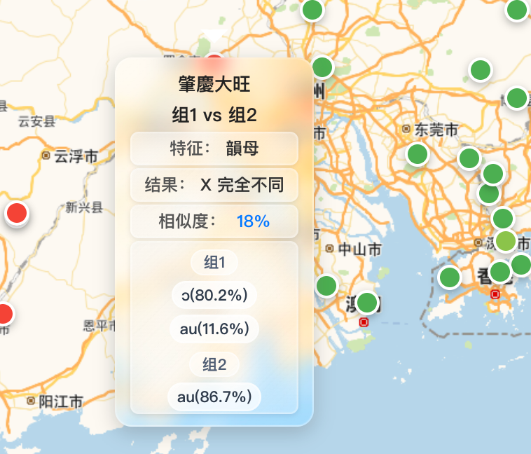

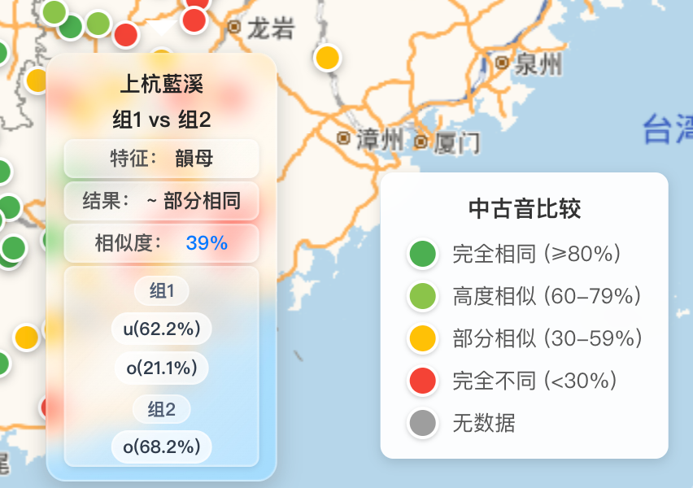

也支持复杂的音韵地位设置：

比如我们想看一看泛粤的[宕江分立](https://zhida.zhihu.com/search?content_id=272535865&content_type=Article&match_order=1&q=%E5%AE%95%E6%B1%9F%E5%88%86%E7%AB%8B&zhida_source=entity)情况，就可以使用复杂的筛选、比较条件。

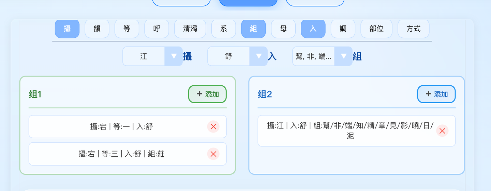

使用多条件，后端处理会比较慢

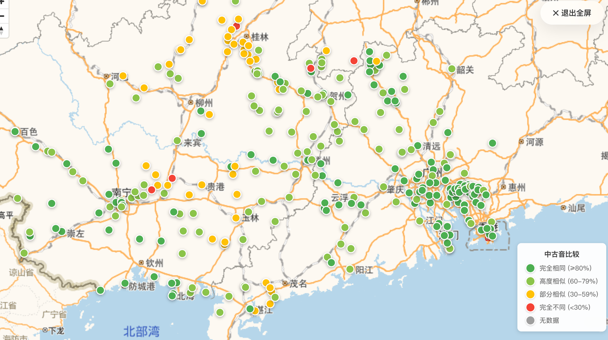

可以比较全面的反映宕江分合情况

也可以弹窗查看具体信息

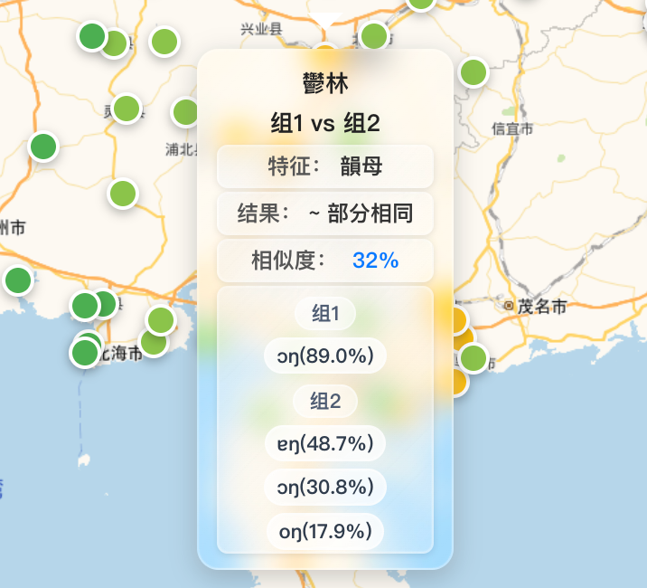

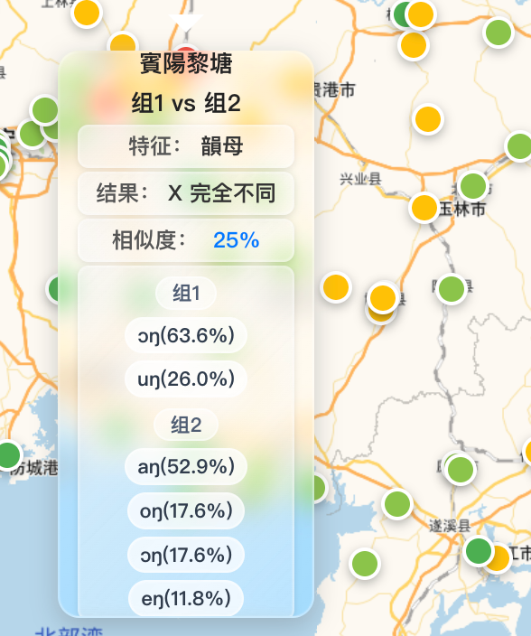

### 相似度算法

假设对于某个[中古音](https://zhida.zhihu.com/search?content_id=272535865&content_type=Article&match_order=1&q=%E4%B8%AD%E5%8F%A4%E9%9F%B3&zhida_source=entity)特征，两组筛选条件在某个地点分别产生了两组读音分布 G1 和 G2。 每组分布包含若干个“读音-百分比”对：

$G_1 = \{ (v_1, p_{1,1}), (v_2, p_{1,2}), \dots, (v_n, p_{1,n}) \}$

$G_2 = \{ (v_1, p_{2,1}), (v_2, p_{2,2}), \dots, (v_n, p_{2,n}) \}$

总重叠度（Overlap）计算公式为：

$$$Overlap = \sum_{i=1}^{n} \min(p_{1,i}, p_{2,i})$$$

* * *

**举几个简单的例子：**

例子 A：高度一致（Same）

假设我们要比较 A 方言区和 B 方言区在“中古入声字”现在的读法。

-   **A 区**：80% 读短促调（入声保留），20% 读长调（舒声化）。
-   **B 区**：75% 读短促调（入声保留），25% 读长调（舒声化）。

**算法逻辑**：

1.  **短促调**：两边都有，重叠部分取最小值，即 **75%**。
2.  **长调**：两边都有，重叠部分取最小值，即 **20%**。
3.  **总相似度**：75% + 20% = 95%。  
    **结论**：两地读音格局几乎一模一样，地图显示**绿色**。

  

例子 B：部分相似/异读分歧（Partial）

比较“咸摄”字在两地的演变，出现了**[文白异读](https://zhida.zhihu.com/search?content_id=272535865&content_type=Article&match_order=1&q=%E6%96%87%E7%99%BD%E5%BC%82%E8%AF%BB&zhida_source=entity)**：

-   **组1（文读）**：100% 读 `[an]`。
-   **组2（白读）**：60% 读 `[a]`，40% 读 `[an]`。

**算法逻辑**：

1.  **读音 `[an]`**：组1有 100%，组2只有 40%，重叠部分取 **40%**。
2.  **读音 `[a]`**：组2有 60%，但组1是 0%，重叠部分取 **0%**。
3.  **总相似度**：40% + 0% = 40%。  
    **结论**：两地有共同点，但主导读音完全不同。地图显示**黄色**。

* * *

其实采用这个算法最主要的原因是**简单，**但该算法的相似度计算过于依赖于音值，对于音类是考虑不足的。因此，也只适用于同一地点内部比较，有效规避了音类的问题（同一地点音值不同就是音类不同）。

## 三、比较调类

例如比较珠三角一带的阳上 阴去 合并情况

因为有不少方言点资料中，没有注明阳上调，所以会显示无数据

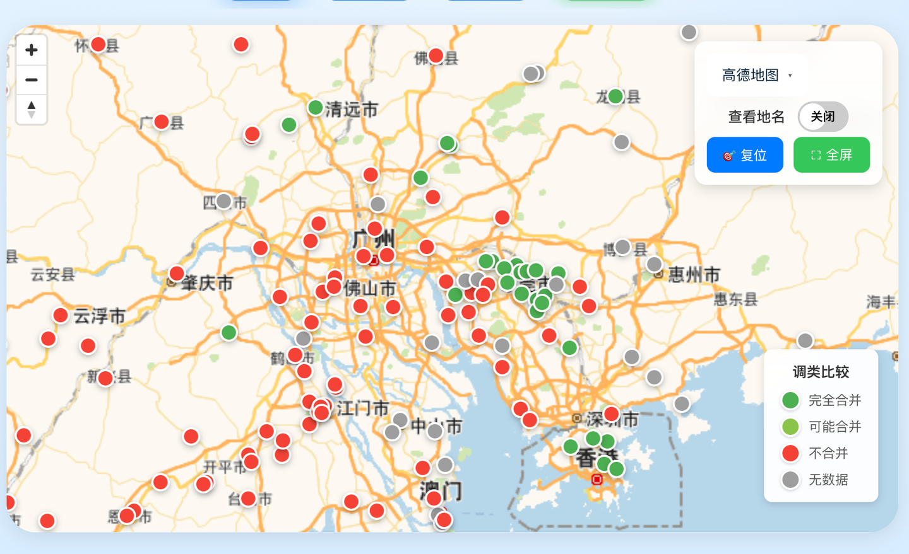

阴平 阴去合并情况

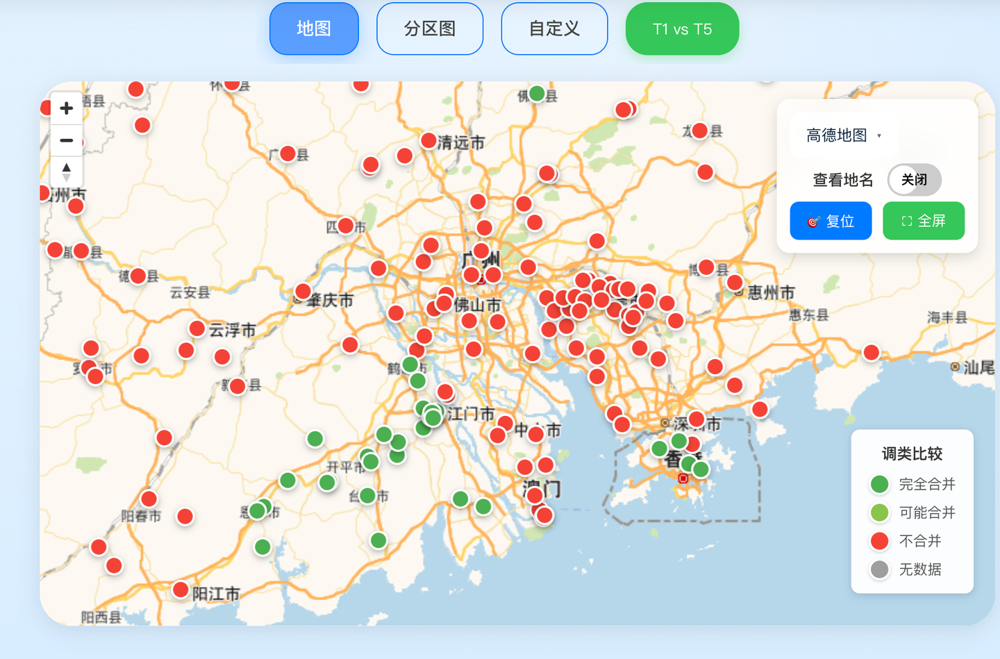

主要是四邑和香港合并了。

其实详细分析后会发现，四邑 莞宝 的阴平 阴去 阳上 三个调，早期调型应该相当接近，比较容易发生合并。要么是阴平阴去合（四邑），要么是阴去阳上合（东莞），要么就是阴平阴去阳上全合（香港），阳上并阴平则是泛客比较常见一点。

也可以一次性分析多一些地点，例如下图是部分南方方言的阴入、[阳入](https://zhida.zhihu.com/search?content_id=272535865&content_type=Article&match_order=1&q=%E9%98%B3%E5%85%A5&zhida_source=entity)两个调类的合并情况：

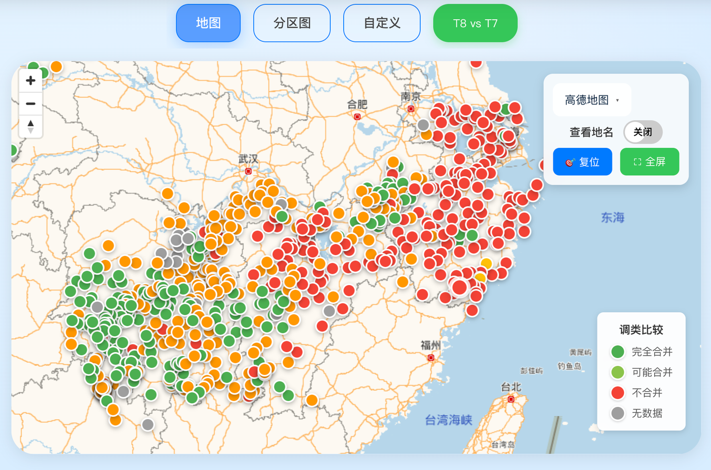

（哎呀，颜色有点问题，橙色是可能合并，图例标的是浅绿色）

## 四、结语

最近「方音圖鑑」用户增长了很多，很高兴网站能帮助到大家。本站提供了相当多的方言、音韵学分析工具，欢迎大家继续探索！

### 1\. 多方言点对比

-   新版网站音韵查询功能(查字、查中古、查音位、查调)介绍：[「方音图鑑」核心查询功能](https://zhuanlan.zhihu.com/p/2047826401479364959)
-   自定义方言分区、自定义绘图介绍：待补充...
-   方言比较功能(字、中古、调类)介绍：[「方音圖鑑」方言比较功能](https://zhuanlan.zhihu.com/p/2023530288848930082)
-   音值比较功能：待补充...

### 2.单方言点深入分析

-   音系分析介绍：[方言音节分析工具](https://zhuanlan.zhihu.com/p/2002848348378521848)
-   方言点演化桑基图、饼图：待补充...

### 3.词句与工具

-   词句(语保)介绍：[语保词汇句子展示](https://zhuanlan.zhihu.com/p/2003637219919946701)
-   praat工具介绍：[声学分析工具(praat网页版)](https://zhuanlan.zhihu.com/p/2007951324780713596)
-   字表工具介绍：[方言字表处理工具](https://zhuanlan.zhihu.com/p/2001363637311381604)
-   地图绘制工具介绍：待补充...

### 4.自然村名分析

-   广东自然村分析介绍：[全粤村情方言数据展示](https://zhuanlan.zhihu.com/p/2005418333642707057)
-   自然村名机器学习分析介绍：待补充...
-   全国村名地理：还没做好...

\- 旧版网站介绍：[方言比较小站开发记录](https://zhuanlan.zhihu.com/p/1934345780199682731)